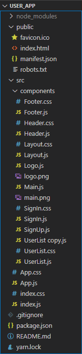
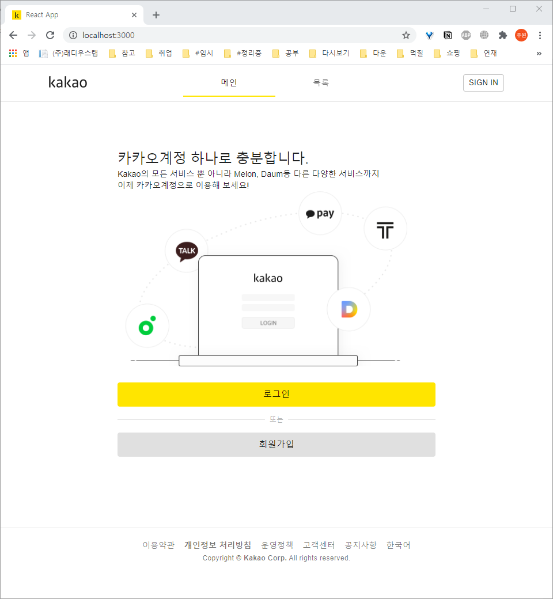
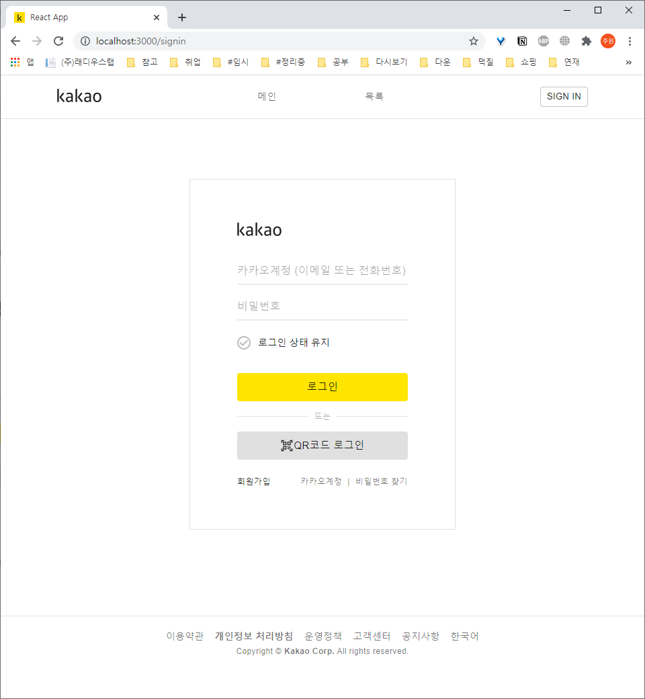
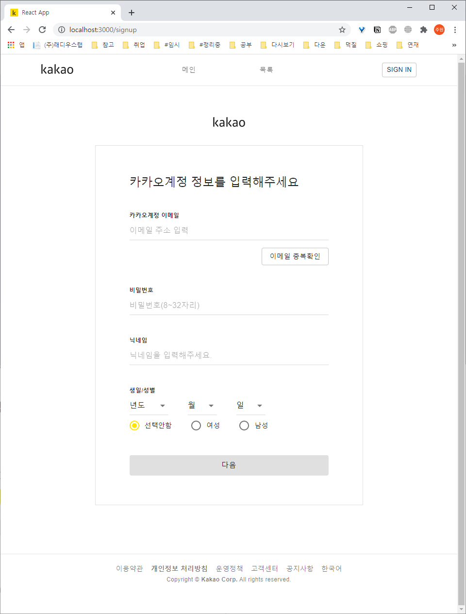
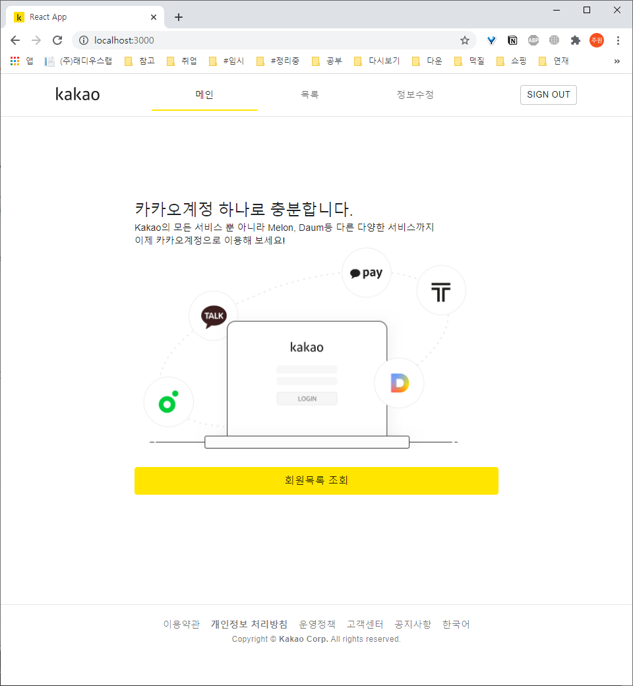
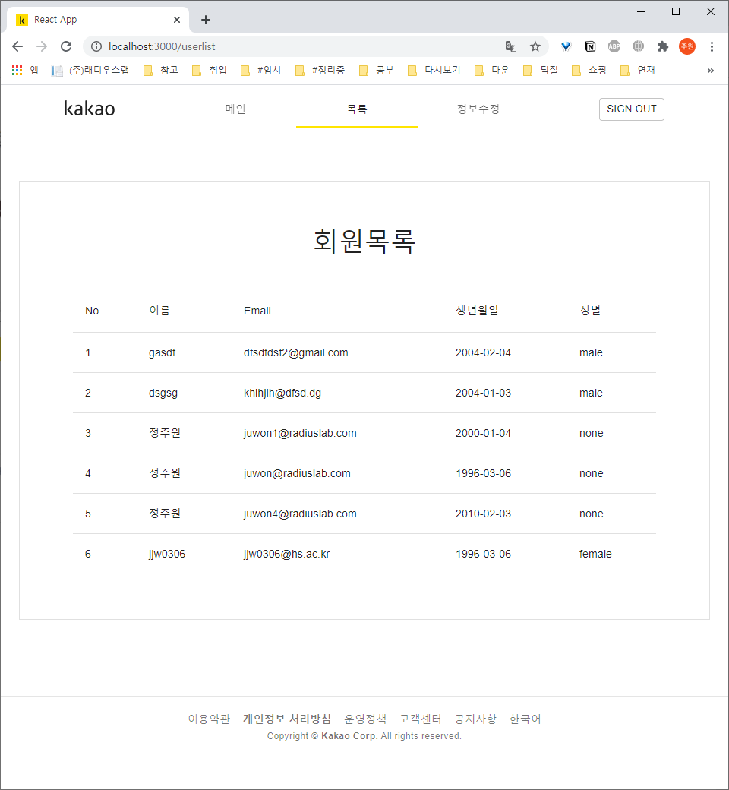
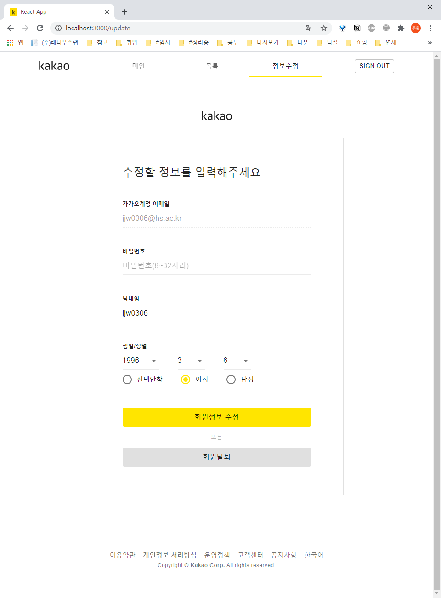
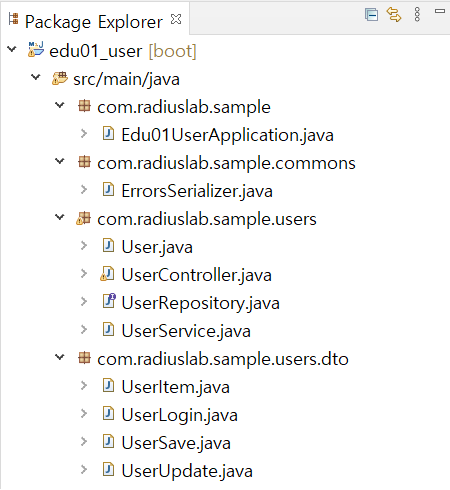

# 회원관리 앱 제작

# Front end

카카오 로그인, 회원가입 페이지 클론코딩

## 환경

node.js+yarn 설치

react 프로젝트 생성+사용 라이브러리 설치

```
yarn create react-app user_app
yarn add react-router-dom
yarn add axios
yarn add @material-ui/core
yarn add @material-ui/icons
```

## 폴더 구조(정리 예정)



## 라우터 구조

```jsx
function App() {
  return (
    <BrowserRouter>
      <ThemeProvider theme={theme}>
        <div className="layout">
          <CssBaseline />
          <Route path="" component={Header} />
          <Route path="/" exact={true} component={Main} />
          <Route path="/signup" exact={true} component={SignUp} />
          <Route path="/signin" exact={true} component={SignIn} />
          <Route path="/userlist" exact={true} component={UserList} />
          <Route path="/update" exact={true} component={SignUp} />
          <Footer />
        </div>
      </ThemeProvider>
    </BrowserRouter>
  );
}

export default App;
```

## UI

메인



로그인



회원가입



로그인 시 메인



로그인 시 회원목록(페이징 추가 예정)



로그인 시 회원정보수정



## rest api 요청 함수

### 회원가입

```jsx
const signUp = async () => {
  // 에러 메시지 초기화
  const list = document.getElementsByClassName("msg");
  for (let i = 0; i < list.length; i++) {
    const element = list[i];
    element.innerText = "";
  }

  // 데이터 준비
  const user = {};
  user.email = document.getElementById("email").value;
  user.password = document.getElementById("password").value;
  user.name = document.getElementById("name").value;
  user.birthday =
    year && month && date
      ? `${year}-${month < 10 ? "0" + month : month}-${
          date < 10 ? "0" + date : date
        }`
      : null;
  user.gender = gender;
  console.log(user);

  //rest api에 post 요청 보내고 결과 처리
  await axios
    .post("/api/users", user)
    .then((data) => {
      console.log(data);
      alert("회원가입이 완료되었습니다.");
      // router로 페이지 이동
      history.replace("/signin");
    })
    .catch((error) => {
      console.log(error.response.data);
      error.response.data.map((e) =>
        document.getElementById(`error_${e.field}`).innerText === "" ||
        e.code === "NotEmpty"
          ? (document.getElementById(`error_${e.field}`).innerText =
              e.defaultMessage)
          : console.log(e.code)
      );
    });
};
```

### 로그인

```jsx
const signIn = async () => {
  document.getElementById(`error_login`).innerText = "";

  const user = {};
  user.email = document.getElementById("email").value;
  user.password = document.getElementById("password").value;
  console.log(user);

  await axios
    .post("/api/users/login", user)
    .then((data) => {
      console.log(data.data);
      alert("로그인 되었습니다.");
      sessionStorage.setItem("login", JSON.stringify(data.data));
      console.log(sessionStorage.getItem("login"));
      // router로 페이지 이동
      history.replace("/");
    })
    .catch((error) => {
      console.log(error.response.data);
      document.getElementById(`error_login`).innerText =
        "이메일 혹은 비밀번호가 일치하지 않습니다. 입력한 내용을 다시 확인해 주세요.";
      // error.response.data.defaultMessage;
    });
};
```

### 로그아웃

```jsx
const signOut = async () => {
  await axios.get("/api/users/logout").then((data) => {
    console.log(data);
    sessionStorage.removeItem("login");
    alert(data.data);
    history.replace("/");
  });
};
```

### 회원정보 수정

```jsx
const update = async () => {
  const list = document.getElementsByClassName("msg");
  for (let i = 0; i < list.length; i++) {
    const element = list[i];
    element.innerText = "";
  }

  const user = {};
  user.password = document.getElementById("password").value;
  if (user.password === "") {
    document.getElementById("error_password").innerText =
      "비밀번호를 입력해주세요.(영문자/숫자/특수문자)";
    return;
  }
  user.name = document.getElementById("name").value;
  if (user.name === "") {
    document.getElementById("error_name").innerText = "이름을 입력해주세요.";
    return;
  }
  user.birthday =
    year && month && date
      ? `${year}-${month < 10 ? "0" + month : month}-${
          date < 10 ? "0" + date : date
        }`
      : null;
  user.gender = gender;
  if (user.gender === "") {
    document.getElementById("error_gender").innerText = "성별을 입력해주세요.";
    return;
  }
  console.log(user);

  await axios
    .put("/api/users", user)
    .then((data) => {
      console.log(data);
      alert("회원정보가 수정되었습니다.");
      sessionStorage.setItem("login", JSON.stringify(data.data));
      console.log(sessionStorage.getItem("login"));
      // router로 페이지 이동
      history.replace("/");
    })
    .catch((error) => {
      console.log(error.response.data);
    });
};
```

회원가입과 회원정보 수정은 같은 js파일을 사용하고 있기때문에 마운트 될때 세션에 정보가 있으면 정보 수정 페이지가 보이도록 `useEffect`를 추가

```jsx
useEffect(() => {
  if (sessionStorage.getItem("login") != null) {
    const user = JSON.parse(sessionStorage.getItem("login"));
    console.log(user);

    document.getElementById("title").innerText = "수정할 정보를 입력해주세요";

    document.getElementById("email").value = user.email;
    // document.getElementById("email").readOnly = true;
    setDisabled(true);
    document.getElementsByClassName("email_chk")[0].style.display = "none";

    document.getElementById("name").value = user.name;

    if (user.birthday != null) {
      const birthday = user.birthday.split("-");
      setYear(birthday[0]);
      setMonth(parseInt(birthday[1]));
      setDate(parseInt(birthday[2]));
    }

    setGender(user.gender);
  }
}, []);
```

### 회원 탈퇴

```jsx
const deleteUser = async () => {
  await axios
    .delete("/api/users")
    .then((data) => {
      console.log(data);
      alert("탈퇴되었습니다.");
      sessionStorage.removeItem("login");
      // router로 페이지 이동
      history.replace("/");
    })
    .catch((error) => {
      console.log(error.response.data);
    });
};
```

### 회원목록

```jsx
const [isLoading, setIsLoading] = useState(true);
const [userList, setUserList] = useState([]);
useEffect(() => {
  axios
    .get("/api/users")
    .then((data) => {
      // console.log(data);
      setUserList(data.data);
      setIsLoading(false);
    })
    .catch((error) => {
      alert(error.response.data);
      history.replace("/signin");
    });
}, []);
```

## 참고

[[JavaScript] session 사용하기 (feat. sessionStorage)](https://mine-it-record.tistory.com/265)

[React | Router : match, location, history](https://gongbu-ing.tistory.com/45)

[Using the State Hook - React](https://ko.reactjs.org/docs/hooks-state.html)

[Using the Effect Hook - React](https://ko.reactjs.org/docs/hooks-effect.html)

# Back end

spring boot기반 rest api

## 패키지 구조



User Entity

```java
package com.radiuslab.sample.users;

import java.time.LocalDate;

import javax.persistence.Entity;
import javax.persistence.GeneratedValue;
import javax.persistence.Id;

import lombok.AllArgsConstructor;
import lombok.Builder;
import lombok.Getter;
import lombok.NoArgsConstructor;
import lombok.Setter;

@Entity(name = "users")
@NoArgsConstructor
@AllArgsConstructor
@Getter @Setter
@Builder
public class User {
	@Id
	@GeneratedValue
	private Long id;

	private String name;
	private String email;
	private String password;
	private LocalDate birthday;
	private String gender;
}
```

## API

[API 문서](https://www.notion.so/2ce2ec5fc74148a181f3db8a935c8218)
